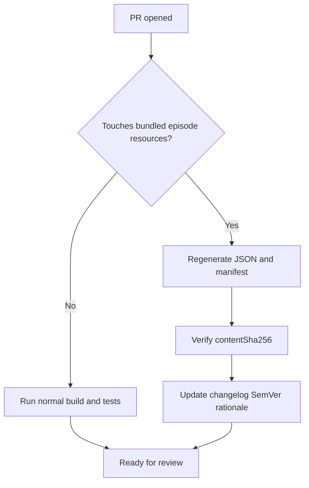

# Summary

<!-- Keep guidance short so external contributors aren't overwhelmed. -->

Briefly explain **what** changed and **why**.

## Scope checklist

Tick any that apply and call out semver impact in your description.

- [ ] **Code — Fix**
- [ ] **Code — Feature**
- [ ] **Data — Episode refresh** (regenerated **`episodes.json`** / **`episodes.manifest.json`**)
- [ ] **Data — Correction** (small targeted edits to bundled episodes)
- [ ] **Build / CI**

## Review decision flow

## Bundled episodes & versioning

Does this PR touch **`Sources/MisterRogersRenamerCore/Resources/episodes.json`** or **`episodes.manifest.json`**?

- [ ] **No**
- [ ] **Yes** — **`contentSha256`** matches regenerated JSON (CI runs [`Scripts/verify_bundled_catalog.py`](../Scripts/verify_bundled_catalog.py)); I updated **[CHANGELOG.md](../CHANGELOG.md)** with PATCH vs MINOR rationale per **[RELEASING.md](../RELEASING.md)**.
