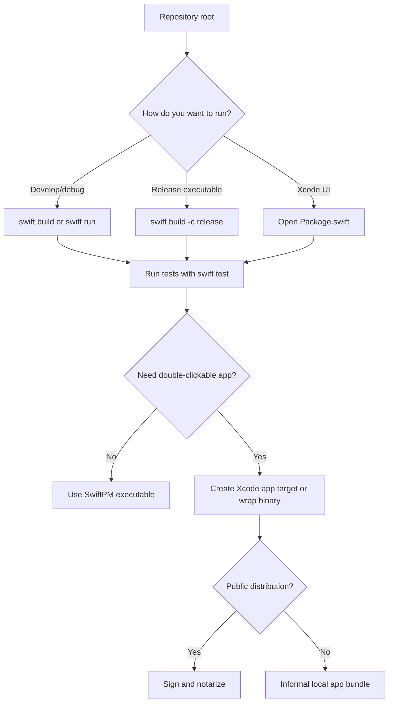

# Build guide

## Swift Package Manager (recommended)

From the repository root:

```bash
swift build              # Debug (core library + executable)
swift build -c release   # Release
swift test               # Parser / SxE unit tests (see also GitHub Actions CI)
```

Run the binary:

```bash
.build/debug/MisterRogersRenamer
.build/release/MisterRogersRenamer
```

## Xcode

1. Open **File → Open…** and choose `Package.swift`.  
2. Select the **MisterRogersRenamer** scheme (executable); the **MisterRogersRenamerCore** target is the shared library.  
3. **Product → Run** (⌘R).

The window obeys the **900×600** minimum size set in code.

## Build path



## Command-line options

This v1 build is GUI-only; there are **no** CLI flags. Use Preview + Rename inside the app.

## Signing and `.app` bundles

`swift build` produces a **standalone executable**, not a bundled `.app`. For a double-clickable app or notarization:

1. Create an **Xcode macOS App** project, add the package as a local dependency **or** copy `Sources/MisterRogersRenamerCore` (and resources) into the app target.  
2. Set **Signing & Capabilities** for your Team.  
3. Use **Product → Archive** and distribute via **Developer ID** or **Mac App Store** as appropriate.

Alternatively, wrap the release binary in a minimal `.app` manually (custom `Info.plist`, `MacOS/` executable) — suitable for informal distribution only unless you sign and notarize.

## Sandboxing

If you enable App Sandbox, grant **User Selected File** read/write for renaming user-chosen files.

## Troubleshooting builds

- **“No such module SwiftUI”** — build for **macOS**, not Linux/Windows.  
- **Older OS** — deployment target is **macOS 12**; lower targets are unsupported.
