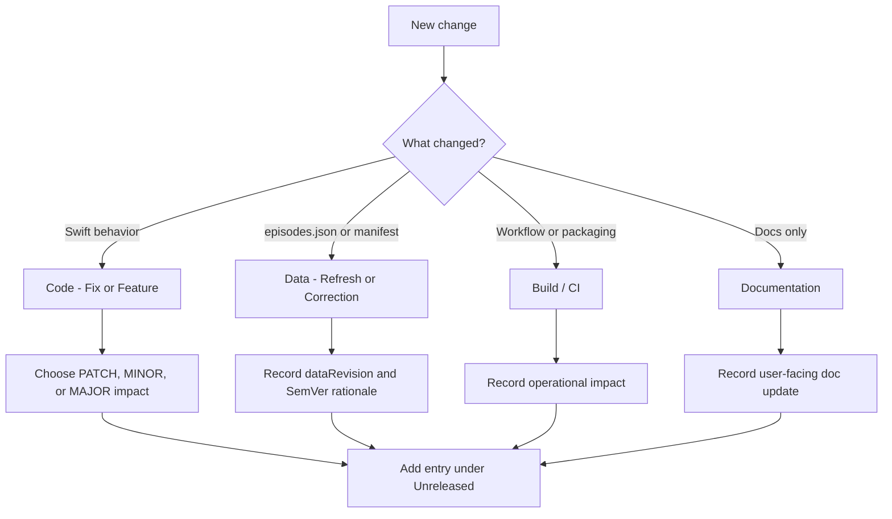

# Changelog

All notable changes to this project will be documented in this file.

The format is based on [Keep a Changelog](https://keepachangelog.com/en/1.1.0/),
and this project adheres to [Semantic Versioning](https://semver.org/spec/v2.0.0.html).

## Change classification flow

## [Unreleased]

### Added

- **`episodes.manifest.json`** next to **`episodes.json`**: **`dataRevision`**, **`contentSha256`** (digest of bundled JSON), **`tvdbSeriesId`**, timestamps — updated by **`Scripts/build_episodes_json.py`**. Footer shows **`dataRevision`** + short SHA prefix for support.
- **`Scripts/verify_bundled_catalog.py`** — asserts manifest digest matches `episodes.json` (run in CI and before release uploads).
- **`Scripts/compose_github_release_notes.py`** — prepends bundled catalog preamble to **`gh`** `releases/generate-notes` output when creating new GitHub Releases.
- **`bundled-data-regen`** workflow ([`.github/workflows/bundled-data-regen.yml`](.github/workflows/bundled-data-regen.yml)): `workflow_dispatch` + weekly **`schedule`**; with repo secret **`TVDB_API_KEY`**, runs **`build_episodes_json.py`** and opens a **[data]** PR via **peter-evans/create-pull-request** (never auto-tags).
- **CI** enhancements ([`.github/workflows/ci.yml`](.github/workflows/ci.yml)): **dorny/paths-filter** outputs for bundled Resource paths vs Swift/Scripts; optional **PR labels** (**`bundled-data`**, **`application-code`**) on same‑repository PRs; digest verification via **`verify_bundled_catalog.py`**.

### Changed

- **Release** workflow ([`.github/workflows/release.yml`](.github/workflows/release.yml)): verify bundled fingerprint before **`swift build`**; new releases use **`compose_github_release_notes.py`** fallback to **`--generate-notes`** on failure.

### Documentation

- **RELEASING.md** — artifact boundary (bundled vs runtime cache vs future Option C), changelog categories, **`release-please`** vs **`semantic-release`** guidance.
