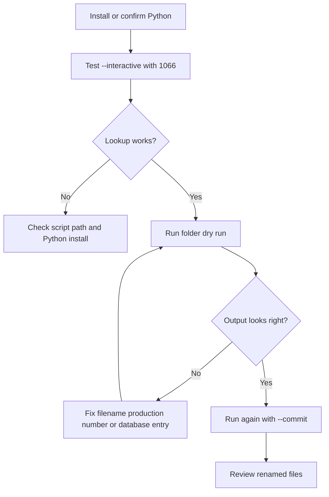

# Quick Start Guide: Mister Rogers' Neighborhood Episode Renamer

A quick reference for getting up and running in 5 minutes.

---

## Step 1: Download the Files

You need two files:

1. **misterrogers_renamer.py** – The main renaming tool
2. **README.md** – Full documentation (this guide + more info)

Save them in your `Downloads` folder (or anywhere convenient).

---

## Step 2: Test Python Installation

Open **Terminal** (Applications → Utilities → Terminal) and paste:

```bash
python3 --version
```

You should see `Python 3.x.x` or higher. If you get "command not found," [install Python](https://www.python.org/downloads/).

---

## Step 3: Test the Tool (Lookup Mode)

In Terminal, type:

```bash
python3 ~/Downloads/misterrogers_renamer.py --interactive
```

You should see a prompt asking for a production number. Try entering `1066`:

```
Production number (1001-1625): 1066

Production 1066:
  Season 3, Episode 1
  Title: Models of the Homes in the Neighborhood of Make-Believe
  Air Date: 1970-02-02
  Suggested filename: S03E01 - Mister Rogers' Neighborhood - "Models of the Homes in the Neighborhood of Make-Believe".mp4
```

Great! It works. Type `quit` to exit.

---

## Step 4: Try Renaming a File (Dry Run)

Move one of your Mister Rogers video files to the same folder as the script. Then:

```bash
python3 ~/Downloads/misterrogers_renamer.py ~/Downloads/
```

You should see what *would* happen, WITHOUT actually renaming anything. This is called "dry run" mode.

Example output:
```
Processing 1 file(s)...
  [DRY RUN MODE - No changes will be made]

  ✓ [WOULD RENAME] 'ep1066.mp4' → 'S03E01 - Mister Rogers' Neighborhood - "Models of the Homes in the Neighborhood of Make-Believe".mp4'

Summary: 1 would be renamed, 0 skipped
```

If this looks right, proceed to Step 5.

---

## Step 5: Actually Rename the Files

When you're confident (after the dry run), add `--commit`:

```bash
python3 ~/Downloads/misterrogers_renamer.py ~/Downloads/ --commit
```

The files will now be renamed! ✓

---

## Quick decision path



## Most Common Commands

**Rename all episodes in a folder (with preview first):**
```bash
python3 ~/Downloads/misterrogers_renamer.py /path/to/episodes/
# Review output, then:
python3 ~/Downloads/misterrogers_renamer.py /path/to/episodes/ --commit
```

**Rename a single file:**
```bash
python3 ~/Downloads/misterrogers_renamer.py /path/to/single_episode.mp4 --commit
```

**Look up an episode by production number:**
```bash
python3 ~/Downloads/misterrogers_renamer.py --interactive
# Then type the production number (e.g., 1066) and press Enter
```

**Process subfolders too:**
```bash
python3 ~/Downloads/misterrogers_renamer.py /path/to/main/folder/ --recursive --commit
```

---

## Production Number: Where to Find It

Watch the episode. At the **start** (usually in the first 5-10 seconds), you'll see text like:

```
PRODUCTION: 1066
```

or

```
Episode 1066
```

This number identifies the episode. Use it in the tool!

---

## Troubleshooting

### "Command not found: python3"
→ Python isn't installed. Download from [python.org](https://www.python.org) or run `brew install python3`

### "Production number not found in database"
→ This production number isn't in the database yet. The tool only has a few entries as a starter. See README.md on how to add more.

### File won't rename despite dry run saying it would
→ File might be open in another app, or you don't have write permission. Try:
   1. Close any video players
   2. Run with `sudo` at the start: `sudo python3 ...` (then enter your Mac password)

### Filename looks weird after renaming
→ Some special characters (like quotes) are automatically removed. This is normal!

---

## What's in the Database?

Currently: **Limited starter entries** (1066-1067 verified)

A complete database would have all 900+ episodes. To help expand it, watch episodes and add production numbers to the database in the script (see README.md for details).

---

## Still Need Help?

1. Read the full **README.md** for complete documentation
2. Check the episode on the **Neighborhood Archive:** https://www.neighborhoodarchive.com/mrn/episodes/[PRODUCTION_NUMBER]/
   - Replace [PRODUCTION_NUMBER] with the actual number, e.g., 1066
3. Verify using **Wikipedia:** https://en.wikipedia.org/wiki/Category:Mister_Rogers'_Neighborhood_seasons

---

**You're ready!** 🎉

Go rename some episodes and enjoy your beautifully organized *Mister Rogers' Neighborhood* collection.
