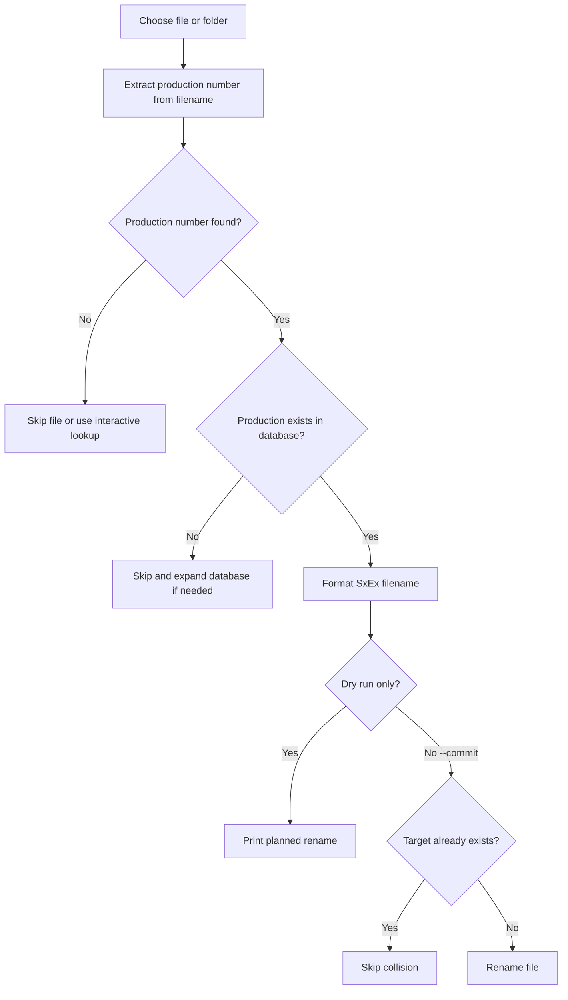
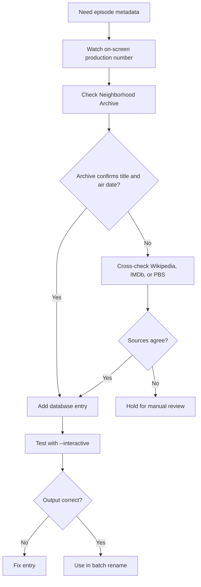

# Mister Rogers' Neighborhood Episode File Renamer

A production-number-based episode renaming tool for *Mister Rogers' Neighborhood* episodes. This tool matches the on-screen production number displayed at the start of each episode to the correct season, episode number, and title, then renames files to the standard format.

---

## Overview

Each episode of *Mister Rogers' Neighborhood* displays a **production number** at the beginning (e.g., "1066"). This tool maps those production numbers to the correct metadata and renames your files automatically.

### Target Format
```
SxEx - Mister Rogers' Neighborhood - "Episode Title".ext
```

**Example:**
```
S03E01 - Mister Rogers' Neighborhood - "Models of the Homes in the Neighborhood of Make-Believe".mp4
```

---

## Process overview





## Requirements

- **Python 3.6+** (usually pre-installed on macOS)
- **Supported file formats:** `.mp4`, `.mkv`, `.avi`, `.mov`, `.m4v`, `.webm`, `.flv`
- **No external Python dependencies** – uses only the Python standard library

### Check Python Installation

Open Terminal and run:
```bash
python3 --version
```

If you get an error, install Python from [python.org](https://www.python.org/downloads/) or via Homebrew:
```bash
brew install python3
```

---

## Installation & Setup

### Option 1: Simple Python Script (Recommended)

1. **Download the renamer script:**
   ```bash
   # Save misterrogers_renamer.py to your preferred location, e.g.:
   # ~/Downloads/ or ~/bin/
   ```

2. **Make it executable:**
   ```bash
   chmod +x ~/Downloads/misterrogers_renamer.py
   ```

3. **Test it:**
   ```bash
   python3 ~/Downloads/misterrogers_renamer.py --interactive
   ```

### Option 2: macOS Drag-and-Drop App (Advanced)

To create a drag-and-drop app on macOS:

1. **Create an Automator Quick Action:**
   - Open **Automator.app** (in Applications > Utilities)
   - File → New → Quick Action
   - Filter/Selection: Files → selected
   - Add action: "Run Shell Script"
   - Shell: `/bin/bash`
   - Pass input: as arguments
   - Script:
     ```bash
     /usr/bin/python3 /path/to/misterrogers_renamer.py "$1" --interactive
     ```
   - Save as "Rename MRN Episodes"

2. **Then drag files onto the app in Finder**

---

## Usage

### Method 1: Interactive Lookup (Test Lookups)

```bash
python3 misterrogers_renamer.py --interactive
```

You'll be prompted to enter production numbers one at a time:
```
Production number (1001-1625): 1066
Production 1066:
  Season 3, Episode 1
  Title: Models of the Homes in the Neighborhood of Make-Believe
  Air Date: 1970-02-02
  Suggested filename: S03E01 - Mister Rogers' Neighborhood - "Models of the Homes in the Neighborhood of Make-Believe".mp4
```

### Method 2: Rename All Files in a Directory (Dry Run First)

```bash
# Preview what WOULD happen (dry run - no changes made):
python3 misterrogers_renamer.py /path/to/video/folder/

# Actually rename the files:
python3 misterrogers_renamer.py /path/to/video/folder/ --commit
```

Example output (dry run):
```
Processing 3 file(s)...
  [DRY RUN MODE - No changes will be made]

  ✓ [WOULD RENAME] 'Episode1066.mp4' → 'S03E01 - Mister Rogers' Neighborhood - "Models of the Homes in the Neighborhood of Make-Believe".mp4'
  ✓ [WOULD RENAME] '1067.mkv' → 'S03E02 - Mister Rogers' Neighborhood - "Trees".mkv'
  - Skipped: production 9999 not found in database

Summary: 2 would be renamed, 1 skipped
```

### Method 3: Single File

```bash
python3 misterrogers_renamer.py /path/to/single_episode.mp4 --commit
```

### Method 4: Recursive (Process Subdirectories)

```bash
python3 misterrogers_renamer.py /path/to/master/folder/ --recursive --commit
```

---

## Production Number Detection

The tool automatically detects production numbers from filenames. It recognizes patterns like:

- `1066` – Plain number
- `Ep1066` or `Episode 1066` – With prefix
- `MRN-1066` – With show code
- `episode1066_description.mp4` – Mixed with text
- `1066 Models of Homes.mp4` – At the start

If the production number cannot be detected automatically, the tool will skip the file (in batch mode) or prompt you (in interactive mode).

---

## The Episode Database

The tool includes a **production number → episode mapping database** that must be populated with complete data from verified sources:

### Current Database Status

As of this version, the database includes **starter entries** for verification. A complete database requires data from:

1. **The Mister Rogers' Neighborhood Archive** (neighborhoodarchive.com)
   - Most comprehensive and authoritative source
   - Covers all 1600+ episodes with air dates and details
   
2. **Wikipedia Season Pages** (en.wikipedia.org)
   - Structured season-by-season episode lists
   - Seasons 1–31 documented with production numbers

3. **IMDb Episode Database** (imdb.com/title/tt0062588/)
   - Cross-reference and verification source

4. **PBS Broadcast Records**
   - Official air dates and archival information

### Database Structure

The database is a Python dictionary in `misterrogers_renamer.py`:

```python
EPISODE_DATABASE = {
    1066: {
        "season": 3,
        "episode": 1,
        "title": "Models of the Homes in the Neighborhood of Make-Believe",
        "air_date": "1970-02-02",
    },
    1067: {
        "season": 3,
        "episode": 2,
        "title": "Trees",
        "air_date": "1970-02-03",
    },
    # ... more entries
}
```

### How to Expand the Database

To add complete production number mappings:

1. Visit the Neighborhood Archive: https://www.neighborhoodarchive.com/mrn/episodes/
2. For each season's episodes, note the production number and metadata
3. Add entries to the `EPISODE_DATABASE` dictionary in the script
4. Test with `--interactive` mode before batch processing

**Example workflow for Season 1:**
- Production 1001 → S01E01 "Mrs. Russellite's Lampshades"
- Production 1002 → S01E02 "The Wall in the Kingdom"
- ... etc.

---

## Known Issues & Limitations

### Database Incompleteness

**Current status:** Starter entries only (1066, 1067 verified)

The full *Mister Rogers' Neighborhood* ran for 34 seasons (1968–2001) with 900+ original episodes and repeated segments. A complete production number database would require systematic data entry from the Neighborhood Archive, which is feasible but time-intensive.

### Season Complexity

The series has a complex structure:
- **Season 1 (1968):** 130 black-and-white episodes
- **Seasons 2–8 (1969–1975):** 65 new color episodes per season
- **Seasons 9–31 (1976–2001):** Mix of new episodes and repeats from earlier seasons

The production numbering does NOT strictly align with displayed "season/episode" due to this repeating nature. This tool maps **production numbers** (which are displayed on-screen), not broadcast "season/episode" numbers.

### Character Escaping

Some episode titles contain special characters (quotes, apostrophes, colons). The tool sanitizes these for filesystem compatibility, which may slightly shorten the filename. For example:

```
Original:  "It's Better to Be Yourself Than to Pretend to Be Somebody Else"
Sanitized: "Its Better to Be Yourself Than to Pretend to Be Somebody Else"
```

### File Collision Handling

If a file with the target name already exists, the tool will skip the file and report a collision. Manually rename one file and re-run.

---

## Verifying Accuracy

### How to Check if a Production Number is Correct

1. **Watch the episode opening:** Most *Mister Rogers' Neighborhood* episodes display the production number in the opening credits (typically bottom right or in text overlay).

2. **Verify against Neighborhood Archive:**
   - Visit: `neighborhoodarchive.com/mrn/episodes/[PRODUCTION_NUMBER]/`
   - Example: `neighborhoodarchive.com/mrn/episodes/1066/`
   - Compare title and air date

3. **Cross-reference with Wikipedia:**
   - Check the season page for the corresponding air date
   - Example: *Mister Rogers' Neighborhood season 3* → February 2, 1970 episode

4. **Spot-check with IMDb:**
   - IMDb titles may differ slightly in punctuation/wording, but should match in content

---

## Source Citations

### Data Sources Used

1. **The Mister Rogers' Neighborhood Archive**
   - URL: https://www.neighborhoodarchive.com/mrn/
   - Description: Official, comprehensive archive maintained with permission from The Fred Rogers Company
   - Data: Episode titles, air dates, production details, cast

2. **Wikipedia: Mister Rogers' Neighborhood**
   - URL: https://en.wikipedia.org/wiki/Mister_Rogers'_Neighborhood
   - Description: Encyclopedic overview with season breakdowns
   - Data: Season structure, episode counts, broadcast dates

3. **Wikipedia Season Pages**
   - Examples: 
     - https://en.wikipedia.org/wiki/Mister_Rogers'_Neighborhood_season_3
     - https://en.wikipedia.org/wiki/Category:Mister_Rogers'_Neighborhood_seasons
   - Data: Detailed episode lists per season

4. **IMDb Episode Database**
   - URL: https://www.imdb.com/title/tt0062588/episodes/
   - Description: Community-maintained episode database with plot summaries
   - Data: Air dates, guest appearances, episode synopses

5. **PBS Broadcast Archives**
   - Reference for official broadcast records and timelines

---

## Advanced Usage

### Renaming with Custom Parameters

If you want to modify the output format, edit the `format_new_filename()` function in the script:

```python
def format_new_filename(season: int, episode: int, title: str, extension: str) -> str:
    # Current format:
    return f"S{season:02d}E{episode:02d} - Mister Rogers' Neighborhood - \"{title}\"{extension}"
    
    # Alternative format (if desired):
    # return f"{season}x{episode} - {title}{extension}"
```

Then re-run the tool.

### Logging Renamed Files

To save a log of all renamed files:

```bash
python3 misterrogers_renamer.py /path/to/folder/ --commit 2>&1 | tee rename_log.txt
```

---

## Troubleshooting

### Python not found
```bash
python3 --version
# If not found, install: brew install python3
```

### "Production number not found in database"
- The production number you're trying to rename is not yet in the database
- Use `--interactive` mode to verify the number is correct
- If correct, the database needs to be expanded with that entry

### File not renamed (dry run shows would rename, but --commit doesn't work)
- Ensure you have write permissions on the directory
- Check that the file isn't locked by another application (e.g., media player)
- Try renaming the file manually first to test

### Special characters in title cause filesystem issues
- The tool automatically sanitizes filenames, removing `<>:"/\|?*`
- This is expected behavior and should not prevent renaming

---

## Contributing / Expanding the Database

To help complete the production number database:

1. **Verify an episode:** Watch it, note the production number, confirm the title
2. **Add to the database:** Add an entry to `EPISODE_DATABASE` in the script with:
   - Production number (key)
   - Season number
   - Episode number (within season)
   - Title (exact from on-screen credits)
   - Air date (YYYY-MM-DD format)
3. **Test:** Use `--interactive` mode to verify your entry
4. **Share:** If you build a complete database, share it with the community

---

## License & Attribution

This tool is provided as-is for personal, non-commercial use. The *Mister Rogers' Neighborhood* series and all associated content is the property of **The Fred Rogers Company**. This tool is designed to assist fans in organizing their personal media collections.

**Sources are cited and credited throughout this documentation.**

---

## Questions?

- **Episode metadata:** Check the Neighborhood Archive (neighborhoodarchive.com)
- **Tool issues:** Review the Troubleshooting section above
- **Database expansion:** See Contributing section

---

## Version History

- **v1.0** (2025): Initial release with starter database entries and CLI interface
  - Verified production numbers: 1066, 1067
  - Full support for Python 3.6+
  - Dry-run and commit modes
  - Interactive lookup mode
  - macOS AppleScript wrapper template

---

**Happy renaming!** 📺✨
