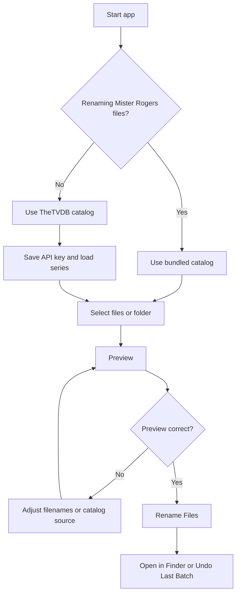

# Quick start (about 2 minutes)

## 1. Install Swift

Use **Xcode 14+** (command-line tools included) or a Swift.org toolchain that supports Swift 5.9+ on macOS 12+.

## 2. Build

```bash
cd "/path/to/Mister Rogers Renamer"
swift build -c release
```

## 3. Run

```bash
.build/release/MisterRogersRenamer
```

Or debug:

```bash
swift run
```

## 4. Use the app

1. Choose **Catalog source**: **Mister Rogers (bundled)** or **Any series (TheTVDB)**. For TheTVDB, save your v4 API key and **Load series** after entering an id or URL.  
2. Click **Select Files** or **Select Folder** (toggle **Scan subfolders** if needed).  
3. Click **Preview** — review original → new names (dry run; **no files change**).  
4. Click **Rename Files** to apply.  
5. Use **Open in Finder** or **Undo Last Batch** as needed.

**Tip:** Drag files or folders onto the dashed drop zone to add them to the selection.

## Quick decision path



## 5. Next steps

- Regenerate **895** bundled episodes with [`Scripts/build_episodes_json.py`](Scripts/build_episodes_json.py) (needs `TVDB_API_KEY`; see [README.md](README.md)).  
- For signed `.app` distribution, read [BUILD_GUIDE.md](BUILD_GUIDE.md).
