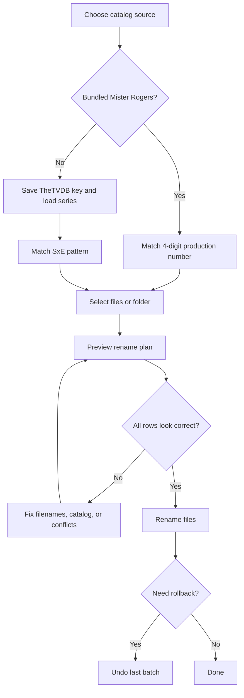
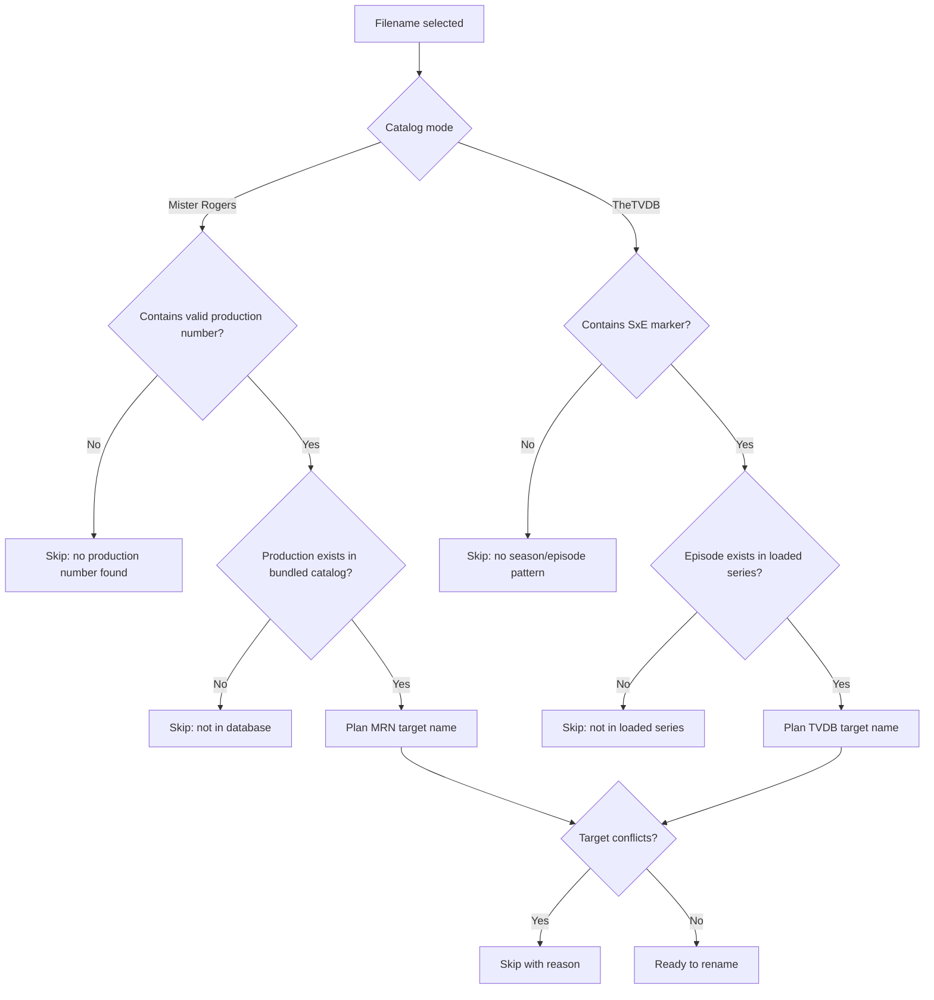
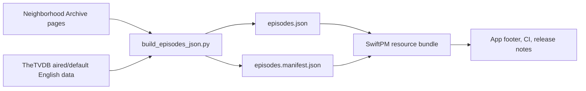

# Mister Rogers’ Neighborhood — Episode Renamer (macOS)

Native **SwiftUI** utility for renaming video files using either **PBS production numbers** and a **bundled** Mister Rogers episode database, or **any series** from **[TheTVDB](https://thetvdb.com)** using **S01E02 / 1x02** patterns in filenames.

## Features

- **Catalog modes** — **Mister Rogers (bundled)** (production-number matching) or **Any series (TheTVDB)** (paste your v4 API key, series URL or id, load episodes from aired/default English listing; filenames must include **SxE**-style markers).  
- **Native pickers** — Choose files or folders with `NSOpenPanel`; optional **recursive** folder scan.
- **Formats** — MP4, MKV, AVI, MOV, M4V, WebM, FLV, TS, MPG, MPEG.
- **Safe workflow** — **Preview / dry run** is the default path; **Rename Files** performs moves only after you confirm.
- **Rules** — Target pattern: `SxEx - {Show Title} - "Episode Title".ext` with unsafe characters stripped; collisions and permission issues surface as **skipped** rows with reasons.
- **Undo** — After a batch rename, **Undo Last Batch** moves files back (same session; files must still exist).

## Process overview





## Requirements

- macOS **12.0** or later  
- Swift **5.9+** (for building from source)

## Quick start

See [QUICKSTART_SWIFT.md](QUICKSTART_SWIFT.md).

## Building

See [BUILD_GUIDE.md](BUILD_GUIDE.md).

## Architecture

See [TECHNICAL_DOCUMENTATION.md](TECHNICAL_DOCUMENTATION.md).

## Contributing and releases

- [CONTRIBUTING.md](CONTRIBUTING.md) — PRs, commit message conventions, CI expectations.
- [RELEASING.md](RELEASING.md) — Versioning (including bundled data vs. code), tags, GitHub Releases, branch protection.
- [CHANGELOG.md](CHANGELOG.md) — Release history.

## TheTVDB mode (in-app)

1. Obtain a **personal [TheTVDB v4 API key](https://thetvdb.com/api-information)**. Never commit it to git.  
2. In the app, choose **Any series (TheTVDB)**, paste the key and click **Save key** (stored in the **Keychain**), or export **`TVDB_API_KEY`** before launch for development.  
3. Enter a **numeric series id** or paste a series page URL whose path contains **`/series/<id>`**, then **Load series**. Episodes are cached under **Application Support → MisterRogersRenamer** (`tvdb-<id>-eng.json`) to reduce API calls.  
4. Filenames must include a recognizable **season/episode** tag (e.g. `S01E02`, `s1e2`, `1x02`). Pure episode numbers or dates are **not** inferred.  
5. Respect [TheTVDB terms](https://thetvdb.com/terms-of-use) and rate limits.

## Episode data (`Sources/MisterRogersRenamerCore/Resources/episodes.json`)



The app ships **`episodes.json`** and **`episodes.manifest.json`** on the **core** target (SwiftPM resources): **895** productions keyed by `id` (on-screen production number); the manifest holds **`dataRevision`** and **`contentSha256`** for releases and troubleshooting (shown in-app in the footer). Metadata is merged from:

1. **The Mister Rogers’ Neighborhood Archive** — production list + first-air dates (per-episode pages).
2. **[TheTVDB](https://thetvdb.com/series/mister-rogers-neighborhood)** (series ID **77750**, [aired order](https://thetvdb.com/series/mister-rogers-neighborhood#seasons)) — **season**, **episode**, and **title**, matched by air date.

To **regenerate** the JSON and manifest (e.g. after a TVDB correction), run locally (never commit a TVDB API key to git):

```bash
export TVDB_API_KEY="your-tvdb-v4-api-key"
python3 Scripts/build_episodes_json.py
```

Optional: `--cache-dir /path` caches Archive HTML (large disk use). Default is **no cache**.

If the bundle is missing or empty, the app falls back to two **seed** episodes (1066, 1067).

**Licensing / API keys:** Respect [TheTVDB terms](https://thetvdb.com/terms-of-use) and the Archive’s “do not duplicate or distribute” notice where applicable. **If an API key was ever pasted into chat or committed, revoke it in your TVDB account and create a new one.**

## Troubleshooting

|Symptom|What to try|
|--------|----------------|
|“No production number found”|Use a **four-digit** production ID in the filename (e.g. `1066`, `Ep1066`, `0001`). Values **1968–2001** are skipped as likely years so `1066` is preferred when both appear.|
|“No season/episode pattern” (TheTVDB mode)|Include **S01E02** or **1x02** (etc.) in the filename stem.|
|“Not in the database”|Regenerate `episodes.json` or add entries manually.|
|“Not in the loaded series” (TheTVDB mode)|Wrong series id, or episode not in aired/default English listing.|
|“Multiple TheTVDB episodes share…”|Rare index collision for the same SxE; fix data at TheTVDB or rename manually.|
|TheTVDB login / HTTP errors|Verify API key, network, and terms; you can delete `tvdb-*-eng.json` under Application Support to refetch.|
|“Target already exists”|Remove or rename the conflicting file, or skip that row.|
|Rename fails with permission error|Grant **Filesystem** access or move files to a folder you own.|

## License

Use and modify for personal or internal needs; attribute episode metadata to original sources when publishing data files.
