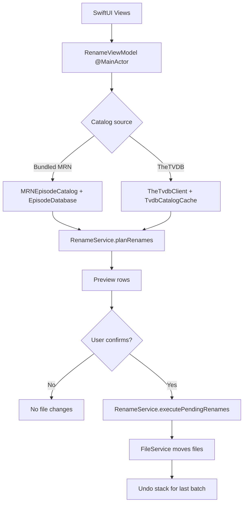
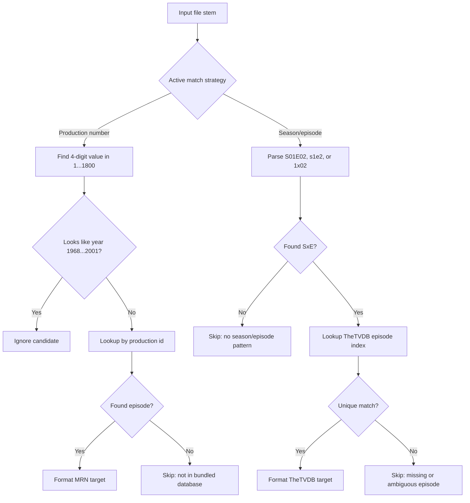
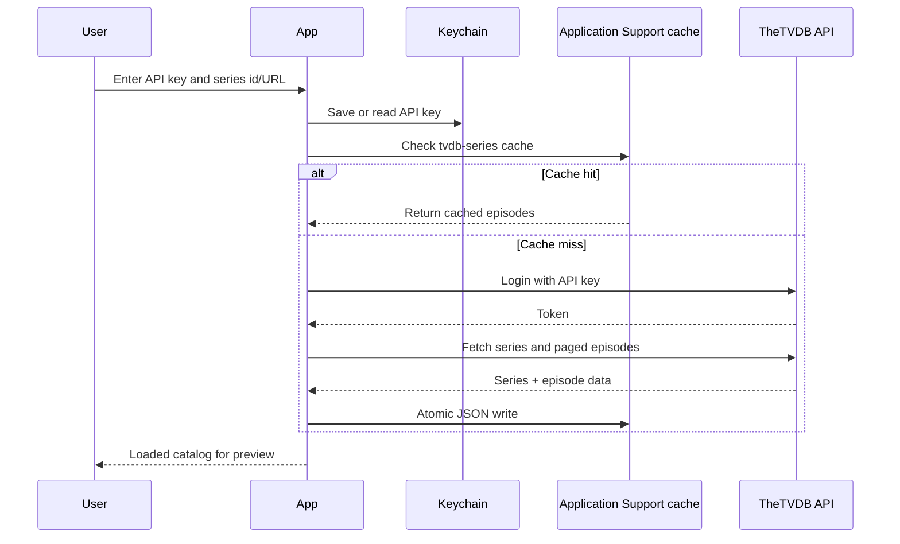

# Technical documentation

## Overview

**MisterRogersRenamer** is a SwiftPM **executable** plus **MisterRogersRenamerCore** library using **SwiftUI** and **MVVM**:

- **Models** — `Episode`, `EpisodeDatabase`, `BundledEpisodeDataManifest` — [`Sources/MisterRogersRenamerCore/Models/`](Sources/MisterRogersRenamerCore/Models/)
- **Services** — `FileUtils`, extractors, `FilenameFormatter`, `RenameService`, `EpisodeCatalog`, TheTVDB client/cache, Keychain key store — [`Sources/MisterRogersRenamerCore/Services/`](Sources/MisterRogersRenamerCore/Services/)
- **ViewModel** — `RenameViewModel` — [`Sources/MisterRogersRenamerCore/ViewModels/RenameViewModel.swift`](Sources/MisterRogersRenamerCore/ViewModels/RenameViewModel.swift)
- **Views** — [`Sources/MisterRogersRenamerCore/Views/`](Sources/MisterRogersRenamerCore/Views/)
- **App shell** — `@main` — [`Sources/MisterRogersRenamer/AppEntry.swift`](Sources/MisterRogersRenamer/AppEntry.swift)

## Data flow

1. User picks **catalog mode** (bundled MRN vs TheTVDB). For TheTVDB, user provides API key (Keychain or `TVDB_API_KEY`) and series id/URL, then **Load** builds a `TvdbEpisodeCatalog` (with optional disk cache).
2. User selects URLs (files/folders) + optional **recursive** scan.
3. **Preview** runs `RenameService.planRenames` off the main thread using the active `EpisodeCatalog` and `RenameMatchStrategy` (production number vs season/episode).
4. **Rename Files** runs `RenameService.executePendingRenames` for rows in `.willRename`; statuses update to `.renamed` or `.error`.
5. **Undo** reverses `.renamed` rows from the last batch by moving files back along stored `(movedTo, original)` pairs.

## Matching

### Mister Rogers (bundled)

- `ProductionNumberExtractor` scans the **filename stem** for **4-digit** sequences in **`1…1800`**, skipping **`1968…2001`** (year ambiguity).
- Lookup: `MRNEpisodeCatalog` → `EpisodeDatabase` by production `id`.

### Any series (TheTVDB)

- `SeasonEpisodeExtractor` recognizes **S01E02**, **s1e3**, **1x02**, etc., on the stem (no bare episode-only inference).
- Lookup: `TvdbEpisodeCatalog` indexes episodes by **(season, episode)** from TheTVDB **aired / default / eng** listing. Duplicate ids for the same SxE are treated as **ambiguous** (skip with reason).

## Filename rules

- **Format:** `SxEx - {Show Title} - "Episode Title".ext` — show title is fixed for MRN; from TheTVDB series record in TVDB mode.
- **Sanitization:** Remove `<>:"/\|?*` and control characters from title and show segments; collapse whitespace.
- **Collisions:** If the target path exists and is not the source file, the row is **skipped**. Duplicate planned targets: **first** wins.

## Episode database (MRN bundle)

- Singleton `EpisodeDatabase.shared` loads **`episodes.json`** from **`Bundle.module`** on the core target ([`Package.swift`](Package.swift)).
- Companion **`episodes.manifest.json`** (same bundle) carries **`dataRevision`** and **`contentSha256`** of `episodes.json` for versioning, CI, and footer display (`BundledEpisodeDataManifest`).
- If loading yields **zero** rows, **1066** and **1067** are **seeded**.
- Regeneration script: [`Scripts/build_episodes_json.py`](Scripts/build_episodes_json.py) (requires `TVDB_API_KEY`; never commit keys). Verification: [`Scripts/verify_bundled_catalog.py`](Scripts/verify_bundled_catalog.py).

## TheTVDB runtime client

- **Auth:** `POST https://api4.thetvdb.com/v4/login` with JSON `{"apikey":…}`.
- **Series name:** `GET …/series/{id}`.
- **Episodes:** `GET …/series/{id}/episodes/default/eng?page=N` until `links.next` is null.
- **Cache:** JSON payloads in Application Support (`MisterRogersRenamer/tvdb-{id}-eng.json`), atomic replace on write.

## Threading

- UI: `@MainActor` view model.
- Planning and file moves: background `DispatchQueue` (`userInitiated`). `RenameService` is `@unchecked Sendable` (read-only catalog use during planning).

## Dependencies

Apple frameworks only: **SwiftUI**, **AppKit**, **Foundation**, **UniformTypeIdentifiers**, **Security** (Keychain).

## Tests

`swift test` — URL/id parsing and season/episode extraction ([`Tests/MisterRogersRenamerTests/`](Tests/MisterRogersRenamerTests/)).
